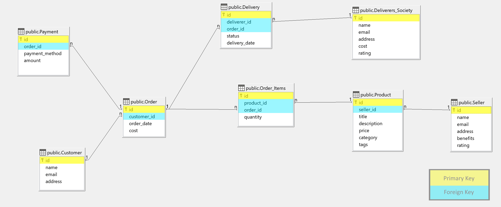

# databaseFinalProject
This is the practical part of the final project.
## Table of Contents 

# Structure


---

The database consists of 8 tables with differents relationship.

## Tables 
- **Customer**: Stores customer information.
- **Seller**: Stores seller information, including benefits and ratings.
- **Deliverers_Society**: Stores information about delivery services, including costs and ratings.
- **Product**: Stores items available for purchase, linked to sellers.
- **Order**: Stores customer orders, linked to customers.
- **Delivery**: Stores delivery information for orders, linked to deliverers and orders.
- **Payment**: Stores payments made for orders.
- **Order_Items**: Links products with orders and stores the quantity of each product.

## Entity Relationship:

- **Customers and Orders** have a one-to-many (1:N) relationship.
- **Sellers and Products** have a one-to-many (1:N) relationship.
- **Deliverers_Society and Delivery** have a one-to-many (1:N) relationship.
- **Orders and Payments** have a one-to-many (1:N) relationship.
- **Orders and Delivery** have a one-to-many (1:N) relationship.
- **Products and Order_Items** have a one-to-many (1:N) relationship.
- **Orders and Order_Items** have a one-to-many (1:N) relationship.


# Documentation
* First you will need [PostgreSQL](https://www.postgresql.org/download/) and [LibreOffice Base](https://www.libreoffice.org/download/download-libreoffice/) (not obligatory).
* Then create a new database.
* Now you can open LibreOffice Base and link the database or directly use the CLI of postgreSQL.
* Last step is to copy-paste all the query for [table creation](#table-creation) and [data insertion](#data-insertion), you can also find it in the git as `creation.sql` and `insertion.sql`.

# The SQL Queries
All the SQL queries used for the Database Implementation (part 3)

## Table Creation
```sql
CREATE TABLE "Customer" (
  "id" SERIAL PRIMARY KEY,

  "name" VARCHAR(255),
  "email" VARCHAR(255),
  "address" TEXT
);
```

```sql
CREATE TABLE "Seller" (
  "id" SERIAL PRIMARY KEY,

  "name" VARCHAR(255),
  "email" VARCHAR(255),
  "address" TEXT,
  "benefits" DECIMAL(10, 2),
  "rating" INTEGER NOT NULL DEFAULT 0 CHECK ("rating" BETWEEN 1 AND 5)
);
```

```sql
CREATE TABLE "Deliverers_Society" (
  "id" SERIAL PRIMARY KEY,

  "name" VARCHAR(255),
  "email" VARCHAR(255),
  "address" TEXT,
  "cost" DECIMAL(10, 2),
  "rating" INTEGER NOT NULL DEFAULT 0 CHECK ("rating" BETWEEN 1 AND 5)
);
```

```sql
CREATE TABLE "Product" (
  "id" SERIAL PRIMARY KEY,

  "seller_id" INTEGER REFERENCES "Seller"("id"),

  "title" VARCHAR(255),
  "description" TEXT,
  "price" DECIMAL(10, 2),
  "category" VARCHAR(50),
  "tags" TEXT
);
```

```sql
CREATE TABLE "Order" (
  "id" SERIAL PRIMARY KEY,

  "customer_id" INTEGER REFERENCES "Customer"("id"),  

  "order_date" DATE NOT NULL DEFAULT CURRENT_DATE,
  "cost" DECIMAL(10, 2) NOT NULL
);
```

```sql
CREATE TABLE "Delivery" (
  "id" SERIAL PRIMARY KEY,

  "deliverer_id" INTEGER REFERENCES "Deliverers_Society"("id"),
  "order_id" INTEGER REFERENCES "Order"("id"),

  "status" VARCHAR(20) NOT NULL CHECK ("status" IN  ('Shipping', 'Delivered', 'Delayed', 'Cancelled')),
  "delivery_date" DATE
);
```

```sql
CREATE TABLE "Payment" (
  "id" SERIAL PRIMARY KEY,

  "order_id" INTEGER REFERENCES "Order"("id"),

  "payment_method" VARCHAR(20),
  "amount" DECIMAL(10, 2) NOT NULL
);
```

```sql
CREATE TABLE "Order_Items" (
  "id" SERIAL PRIMARY KEY,

  "product_id" INTEGER REFERENCES "Product"("id"),
  "order_id" INTEGER REFERENCES "Order"("id"),

  "quantity" INTEGER NOT NULL DEFAULT 1
);
```

## Data Insertion

```sql
INSERT INTO "Customer" ("id", "name", "email", "address") VALUES
  (567, 'Peter Parker', 'peter.parker@example.com', '20 Ingram Street, New York, NY'),
  (568, 'Tony Stark', 'tony.stark@example.com', '10880 Malibu Point, Malibu, CA'),
  (569, 'Wade Wilson', 'deadpool@example.com', '1234 Chimichanga Lane, Mexico'),
  (570, 'Solanum Nomai', 'solanum.nomai@example.com', 'Outer Wilds, Space'),
  (571, 'Rihanna', 'rihanna@example.com', '123 Music Lane, Barbados');
```

```sql
INSERT INTO "Seller" ("id", "name", "email", "address", "benefits", "rating") VALUES
  (123, 'Sony', 'sony@example.com', '123 Main Street', 1000.00, 4),
  (231, 'Lucasfilm', 'lucasfilm@example.com', '456 Elm Street', 500.00, 3),
  (761, 'Microsoft', 'def.co@example.com', '789 Oak Street', 2000.00, 5);
```

```sql
INSERT INTO "Deliverers_Society" ("id", "name", "email", "address", "cost", "rating") VALUES
  (1, 'FedEx Express', 'fedex@example.com', 'Croatia', 10.00, 4),
  (2, 'United Parcel Service', 'ups@example.com', 'Mars', 15.00, 3),
  (3, 'Amazon', 'amazon@example.com', 'U.S', 20.00, 5);
```

```sql
INSERT INTO "Product" ("id", "seller_id", "title", "description", "price", "category", "tags") VALUES
  (921, 123, 'Outer Wilds', 'World Best Experience', 49.99, 'Video Game', 'action, adventure, exploration'),
  (922, 123, 'Minecraft', 'A creative sandbox game where you can build, mine, and survive in a blocky world.', 26.99, 'Video Game', 'sandbox, building, multiplayer'),
  (923, 231, 'Dead Cells', 'A rogue-lite, metroidvania inspired action-platformer with challenging gameplay and an engaging storyline.', 59.99, 'Video Game', 'action, adventure, roguelike'),
  (924, 761, 'USB Flash Drive', 'Reliable 16GB USB flash drive, perfect for storing and transferring your important files.', 15.99, 'Accessory', 'storage, tech, USB'),
  (925, 231, 'Chair', 'Ergonomically designed office chair for maximum comfort during long hours of work or gaming.', 79.99, 'Furniture', 'home, office, seating');
```

```sql
INSERT INTO "Order" ("id", "customer_id", "order_date", "cost") VALUES
  (981, 567, '2024-01-01', 49.99),
  (567, 570, '2024-09-15', 53.98),
  (451, 568, '2024-09-15', 319.96),
  (862, 567, '2024-12-01', 75.98);
```

```sql
INSERT INTO "Order_Items" ("product_id", "order_id", "quantity") VALUES
  (921, 981, 1),  -- Outer Wilds *1
  (922, 567, 2),  -- Minecraft *2
  (925, 451, 4),  -- Chair *4
  (923, 862, 1),  -- Dead Cells
  (924, 862, 1);  -- USB Flash Drive
```

```sql
INSERT INTO "Payment" ("order_id", "payment_method", "amount") VALUES
  (981, 'Credit Card', 49.99),
  (567, 'PayPal', 53.98),
  (451, 'Check', 319.96),
  (862, 'Credit Card', 75.98);
```

```sql
INSERT INTO "Delivery" ("deliverer_id", "order_id", "status", "delivery_date") VALUES
  (1, 981, 'Delivered', '2024-01-05'),
  (2, 567, 'Shipping', '2024-09-20'),
  (3, 451, 'Delivered', '2024-09-18'),
  (1, 862, 'Delayed', '2025-09-05');
```


## Queries

### 1. Retrieve All Sellers with Ratings Above 4
```sql
SELECT * FROM "Seller" WHERE "rating" > 4;
```
<details>
<summary>Click to see the Output</summary>

| id  | name      | email              | address        | benefits | rating |
|-----|-----------|--------------------|----------------|----------|--------|
| 761 | Microsoft | def.co@example.com | 789 Oak Street | 2000,oo  | 5      |

</details>

### 2. Find All Products in the "Video Game" Category
```sql
SELECT * FROM "Product" WHERE "category" = 'Video Game';
```

<details>
<summary>Click to see the Output</summary>

| id  | seller Id | title       | description   | price | category   | tags     |
|-----|-----------|-------------|---------------|-------|------------|----------|
| 921 | 123       | Outer Wilds | World Best    | 49,99 | Video Game | action,  |
| 922 | 123       | Minecraft   | A Creative    | 26,99 | Video Game | sandbox, |
| 923 | 231       | Dead Cells  | A rogue-lite, | 59,99 | Video Game | action,  |

</details>

### 3. Get All Orders for a Specific Customer
```sql
SELECT * FROM "Order" WHERE "customer_id" = 567;
```

<details>
<summary>Click to see the Output</summary>

| id  | customer id | order date | cost  |
|-----|-------------|------------|-------|
| 981 | 567         | 01/01/24   | 49,99 |
| 862 | 567         | 01/12/24   | 75,98 |

</details>

### 4. Find Deliveries with a Status of "Shipping"
```sql
SELECT * FROM "Delivery" WHERE "status" = 'Shipping';
```

<details>
<summary>Click to see the Output</summary>

| id | deliverer Id | order Id | status   | delivery_date |
|----|--------------|----------|----------|---------------|
| 6  | 2            | 567      | Shipping | 20/09/24      |

</details>

### 5. Retrieve Order Details Including Product Information
```sql
SELECT o."id" AS order_id, oi."quantity", p."title", p."price"
FROM "Order" o
JOIN "Order_Items" oi ON o."id" = oi."order_id"
JOIN "Product" p ON oi."product_id" = p."id";
```

<details>
<summary>Click to see the Output</summary>

| order id | quantity | title           | price |
|----------|----------|-----------------|-------|
| 981      | 1        | Outer Wilds     | 49,99 |
| 567      | 2        | Minecraft       | 26,99 |
| 451      | 4        | Chair           | 79,99 |
| 862      | 1        | Dead Cells      | 59,99 |
| 862      | 1        | USB Flash Drive | 15,99 |

</details>

### 6. Get Total Cost of Each Order
```sql
SELECT o."id" AS order_id, SUM(oi."quantity" * p."price") AS total_cost
FROM "Order" o
JOIN "Order_Items" oi ON o."id" = oi."order_id"
JOIN "Product" p ON oi."product_id" = p."id"
GROUP BY o."id";
```

<details>
<summary>Click to see the Output</summary>

| order id | total cost |
|----------|------------|
| 567      | 53,98      |
| 981      | 49,99      |
| 862      | 75,98      |
| 451      | 319,96     |

</details>

### 7. List All Payments Made by Customers
```sql
SELECT p."id", o."id" AS order_id, p."payment_method", p."amount"
FROM "Payment" p
JOIN "Order" o ON p."order_id" = o."id";
```

<details>
<summary>Click to see the Output</summary>

| id | order Id | payment_met... | amount |
|----|----------|----------------|--------|
| 8  | 981      | Credit Card    | 49,99  |
| 9  | 567      | PayPal         | 53,98  |
| 10 | 451      | Check          | 319,96 |
| 11 | 862      | Credit Card    | 75,98  |

</details>

### 8. Get Average Rating of Deliverers
```sql
SELECT AVG("rating") AS average_rating
FROM "Deliverers_Society";
```

<details>
<summary>Click to see the Output</summary>

| average_rating |
|----------------|
| 4              |

</details>

### 9. Find All Products with a Price Greater Than $50
```sql
SELECT * FROM "Product" WHERE "price" > 50.00;
```

<details>
<summary>Click to see the Output</summary>

| id  | seller Id | title      | description   | price | category   | tags          |
|-----|-----------|------------|---------------|-------|------------|---------------|
| 923 | 231       | Dead Cells | A rogue-lite, | 59,99 | Video Game | action,       |
| 925 | 231       | Chair      | Ergonomically | 79,99 | Furn iture | home, office, |

</details>

### 10. Retrieve All Customers with Total Orders and Amount Spent
```sql
SELECT c."id", c."name", c."email", c."address", 
       COUNT(o."id") AS total_orders, 
       COALESCE(SUM(o."cost"), 0) AS total_amount_spent
FROM "Customer" c
LEFT JOIN "Order" o ON c."id" = o."customer_id"
GROUP BY c."id", c."name", c."email", c."address"
ORDER BY total_orders DESC;
```

<details>
<summary>Click to see the Output</summary>

| id  | name         | address                       | total_orders | total_amount_spent |
|-----|--------------|-------------------------------|--------------|--------------------|
| 567 | Peter Parker | 20 Ingram Street, New York,   | 2            | 125,97             |
| 568 | Tony Stark   | 10880 Malibu Point, Malibu,   | 1            | 319,96             |
| 570 | Solanum Noma | Outer Wilds, Space            | 1            | 53,98              |
| 571 | Rihanna      | 123 Music Lane, Barbados      | 0            | 0                  |
| 569 | Wade Wilson  | 1234 Chimichanga Lane, Mexico | 0            | 0                  |

</details>


### Query to Find the Most Sold Product
```sql
SELECT p."id", p."title", SUM(oi."quantity") AS total_sold
FROM "Product" p
JOIN "Order_Items" oi ON p."id" = oi."product_id"
GROUP BY p."id", p."title"
ORDER BY total_sold DESC
LIMIT 1;
```

<details>
<summary>Click to see the Output</summary>

| id  | title | total sold |
|-----|-------|------------|
| 925 | Chair | 4          |

</details>

# License
If by some hasard you come across this git, feel free to use it as you wish. :)